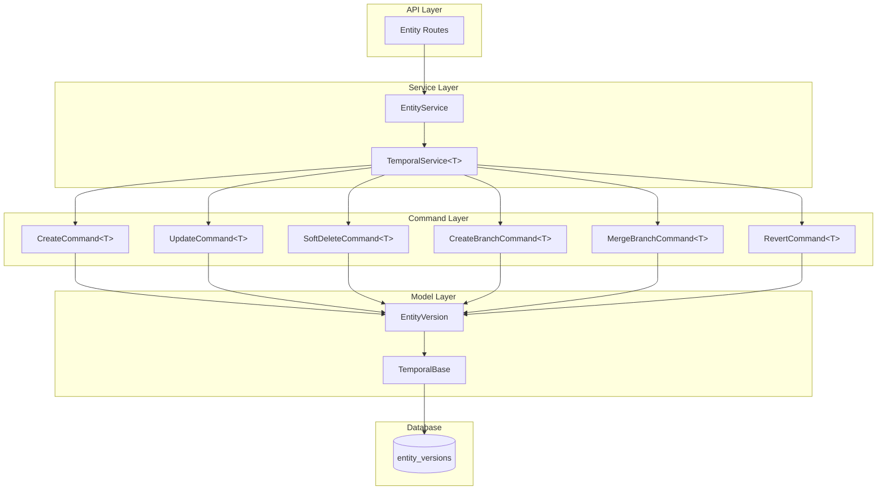

# EVCS Core Architecture

**Last Updated:** 2026-01-01  
**Owner:** Backend Team  
**ADR:** [ADR-005: Bitemporal Versioning](../../decisions/ADR-005-bitemporal-versioning.md)

---

## Responsibility

The Entity Versioning Control System (EVCS) Core provides Git-like versioning capabilities for all database entities. It enables:

- **Complete History:** Every change creates a new immutable version
- **Time Travel:** Query entity state at any past point in time
- **Branch Isolation:** Develop changes in isolation before merging
- **Bitemporal Tracking:** Track both valid time (business) and transaction time (system)
- **Soft Delete:** Reversible deletion with recovery capability

---

## Architecture

### Component Overview



### Layer Responsibilities

| Layer        | Responsibility                            | Key Classes                                    |
| ------------ | ----------------------------------------- | ---------------------------------------------- |
| **API**      | HTTP endpoints, request/response handling | FastAPI routers                                |
| **Service**  | Business logic orchestration              | `TemporalService[T]`, entity-specific services |
| **Command**  | Atomic versioning operations              | `CreateCommand[T]`, `UpdateCommand[T]`, etc.   |
| **Model**    | Data structures, ORM mapping              | `TemporalBase`, entity models                  |
| **Database** | Persistence, indexing, constraints        | PostgreSQL with GIST indexes                   |

---

## Core Components

### TemporalBase (Abstract Base Class)

The foundation for all versioned entities. Provides common temporal fields and behaviors.

```python
class TemporalBase(Base):
    """Abstract base for bitemporal entities with branching and soft-delete."""

    __abstract__ = True

    # Unique version identifier
    id: Mapped[UUID] = mapped_column(PG_UUID, primary_key=True, default=uuid4)

    # Temporal validity (PostgreSQL TSTZRANGE)
    valid_time: Mapped[TSTZRANGE] = mapped_column(
        TSTZRANGE,
        nullable=False,
        server_default=func.tstzrange(func.now(), None, "[]")
    )

    # Transaction time (when recorded in DB)
    transaction_time: Mapped[TSTZRANGE] = mapped_column(
        TSTZRANGE,
        nullable=False,
        server_default=func.tstzrange(func.now(), func.now(), "[]")
    )

    # Soft delete
    deleted_at: Mapped[datetime | None] = mapped_column(nullable=True)

    # Branching
    branch: Mapped[str | None] = mapped_column(String(80), default="main")
    parent_id: Mapped[UUID | None] = mapped_column(PG_UUID, nullable=True)
    merge_from_branch: Mapped[str | None] = mapped_column(String(80), nullable=True)
```

#### Key Properties

| Property            | Type      | Description                                  |
| ------------------- | --------- | -------------------------------------------- |
| `id`                | UUID      | Unique identifier for this specific version  |
| `{entity}_id`       | UUID      | Stable root identifier (defined in subclass) |
| `valid_time`        | TSTZRANGE | Business validity period `[start, end)`      |
| `transaction_time`  | TSTZRANGE | System recording period                      |
| `deleted_at`        | datetime  | Soft delete timestamp (NULL = active)        |
| `branch`            | str       | Branch name (default: "main")                |
| `parent_id`         | UUID      | Previous version forming DAG                 |
| `merge_from_branch` | str       | Source branch for merged versions            |

#### Key Methods

```python
@property
def is_current(self) -> bool:
    """Check if this is the current active version."""
    ...

def clone(self, **overrides) -> Self:
    """Clone version for updates/branches/merges."""
    ...

def soft_delete(self) -> None:
    """Mark version as deleted."""
    ...

def undelete(self) -> None:
    """Restore deleted version."""
    ...

@classmethod
def current_for(cls, session, *, where, order_by_desc=True) -> T | None:
    """Query current version matching criteria."""
    ...

@classmethod
def close_current(cls, session, *, where, end_time=None) -> T | None:
    """Close current version by setting valid_time upper bound."""
    ...
```

---

### Generic Commands

Commands encapsulate atomic versioning operations with consistent behavior across all entity types.

#### CreateCommand[T]

Creates a new entity with its initial version.

```python
class CreateCommand(Generic[T]):
    def __init__(
        self,
        entity_class: Type[T],
        root_id: UUID,
        branch: str = "main",
        **fields
    ): ...

    def execute(self, session: Session) -> T:
        """Create entity version and add to session."""
        ...
```

#### UpdateCommand[T]

Closes current version and creates new version with changes.

```python
class UpdateCommand(Generic[T]):
    def __init__(
        self,
        entity_class: Type[T],
        root_id: UUID,
        updates: dict[str, Any],
        branch: str = "main"
    ): ...

    def execute(self, session: Session) -> T:
        """Close current, create new version with updates."""
        ...
```

#### SoftDeleteCommand[T]

Marks the current version as deleted (reversible).

```python
class SoftDeleteCommand(Generic[T]):
    def execute(self, session: Session) -> T | None:
        """Set deleted_at on current version."""
        ...
```

#### CreateBranchCommand[T]

Creates a new branch by cloning the current version.

```python
class CreateBranchCommand(Generic[T]):
    def __init__(
        self,
        entity_class: Type[T],
        root_id: UUID,
        new_branch: str,
        from_branch: str = "main"
    ): ...

    def execute(self, session: Session) -> T:
        """Clone current version to new branch."""
        ...
```

#### MergeBranchCommand[T]

Merges source branch into target branch (overwrite strategy).

```python
class MergeBranchCommand(Generic[T]):
    def execute(self, session: Session) -> T:
        """Close target, clone source to target with merge tracking."""
        ...
```

#### RevertCommand[T]

Reverts to a previous version (creates new version with old state).

```python
class RevertCommand(Generic[T]):
    def execute(self, session: Session) -> T | None:
        """Close current, create new version from parent state."""
        ...
```

---

### Generic Service

Base service class providing standard operations for all temporal entities.

```python
class TemporalService(Generic[T]):
    def __init__(self, session: Session, entity_class: Type[T]):
        self.session = session
        self.entity_class = entity_class
        self.root_field = f"{entity_class.__name__.lower().removesuffix('version')}_id"

    def create(self, root_id: UUID, branch: str = "main", **fields) -> T:
        """Create new entity."""
        ...

    def get_current(
        self, root_id: UUID, branch: str = "main", include_deleted: bool = False
    ) -> T | None:
        """Get current version."""
        ...

    def update(self, root_id: UUID, updates: dict, branch: str = "main") -> T:
        """Update entity (creates new version)."""
        ...

    def soft_delete(self, root_id: UUID, branch: str = "main") -> T | None:
        """Soft delete entity."""
        ...

    def undelete(self, root_id: UUID, branch: str = "main") -> T | None:
        """Restore deleted entity."""
        ...

    def create_branch(
        self, root_id: UUID, new_branch: str, from_branch: str = "main"
    ) -> T:
        """Create new branch."""
        ...

    def merge_branch(
        self, root_id: UUID, source_branch: str, target_branch: str = "main"
    ) -> T:
        """Merge branches."""
        ...

    def revert(
        self, root_id: UUID, branch: str = "main", to_version_id: UUID | None = None
    ) -> T | None:
        """Revert to previous version."""
        ...
```

---

## Data Model

### Version Table Structure

Each versioned entity has a single table with this structure:

| Column                | Type             | Description               |
| --------------------- | ---------------- | ------------------------- |
| `id`                  | UUID (PK)        | Unique version identifier |
| `{entity}_id`         | UUID (Index)     | Stable entity root ID     |
| `valid_time`          | TSTZRANGE        | Business validity period  |
| `transaction_time`    | TSTZRANGE        | System recording period   |
| `deleted_at`          | TIMESTAMPTZ      | Soft delete timestamp     |
| `branch`              | VARCHAR(80)      | Branch name               |
| `parent_id`           | UUID (FK, Index) | Previous version ID       |
| `merge_from_branch`   | VARCHAR(80)      | Merge source branch       |
| `...domain fields...` | various          | Entity-specific data      |

### Indexing Strategy

```sql
-- GIST indexes for range queries
CREATE INDEX ix_{table}_valid_gist ON {table} USING GIST (valid_time);
CREATE INDEX ix_{table}_tx_gist ON {table} USING GIST (transaction_time);

-- B-tree indexes for lookups
CREATE INDEX ix_{table}_entity_id ON {table} ({entity}_id);
CREATE INDEX ix_{table}_branch ON {table} (branch);
CREATE INDEX ix_{table}_parent ON {table} (parent_id);

-- Partial unique index: one current version per entity per branch
CREATE UNIQUE INDEX uq_{table}_current_branch ON {table} ({entity}_id, branch)
WHERE upper(valid_time) IS NULL
  AND upper(transaction_time) IS NULL
  AND deleted_at IS NULL;
```

---

## Integration Points

### Used By

- All versioned entities (Project, WBE, CostElement, etc.)
- Change Order system (branch creation/merging)
- Time Machine feature (temporal queries)
- Audit reporting (history views)

### Provides

- `TemporalBase` for entity inheritance
- `TemporalService[T]` for service extension
- Generic commands for all CRUD operations
- Temporal query helpers

---

## Non-Versioned Entities

Not all entities require temporal versioning. System configuration, user preferences, and similar data use a simplified pattern while maintaining consistent architecture.

### When to Use Non-Versioned Entities

| Use Case                 | Examples                            | Rationale                                     |
| ------------------------ | ----------------------------------- | --------------------------------------------- |
| **User Preferences**     | Theme, locale, dashboard layout     | User-specific settings, no audit trail needed |
| **System Configuration** | Feature flags, integration settings | Admin-managed, changes logged externally      |
| **Transient Data**       | Session state, cache entries        | Short-lived, no historical value              |
| **Reference Data**       | Country codes, currencies           | Rarely changes, loaded from fixtures          |

### SimpleBase (Abstract Base Class)

Non-versioned entities inherit from `SimpleBase` instead of `TemporalBase`:

```python
class SimpleBase(Base):
    """Abstract base for non-versioned entities."""

    __abstract__ = True

    id: Mapped[UUID] = mapped_column(PG_UUID, primary_key=True, default=uuid4)
    created_at: Mapped[datetime] = mapped_column(
        nullable=False,
        server_default=func.now()
    )
    updated_at: Mapped[datetime] = mapped_column(
        nullable=False,
        server_default=func.now(),
        onupdate=func.now()
    )
```

### SimpleService[T]

A simplified service base for non-versioned entities:

```python
class SimpleService(Generic[T]):
    """Base service for non-versioned entities."""

    def __init__(self, session: Session, entity_class: Type[T]):
        self.session = session
        self.entity_class = entity_class

    def get(self, entity_id: UUID) -> T | None:
        """Get entity by ID."""
        ...

    def get_all(self, skip: int = 0, limit: int = 100) -> list[T]:
        """Get paginated list of entities."""
        ...

    def create(self, **fields) -> T:
        """Create new entity."""
        ...

    def update(self, entity_id: UUID, **updates) -> T | None:
        """Update entity in place (no versioning)."""
        ...

    def delete(self, entity_id: UUID) -> bool:
        """Hard delete entity."""
        ...
```

### Simple Commands

Commands for non-versioned entities follow the same pattern but without temporal logic:

```python
class SimpleCreateCommand(Generic[T]):
    """Create a non-versioned entity."""

    def __init__(self, entity_class: Type[T], **fields):
        self.entity_class = entity_class
        self.fields = fields

    def execute(self, session: Session) -> T:
        entity = self.entity_class(**self.fields)
        session.add(entity)
        return entity


class SimpleUpdateCommand(Generic[T]):
    """Update a non-versioned entity in place."""

    def __init__(self, entity_class: Type[T], entity_id: UUID, **updates):
        self.entity_class = entity_class
        self.entity_id = entity_id
        self.updates = updates

    def execute(self, session: Session) -> T | None:
        entity = session.get(self.entity_class, self.entity_id)
        if entity:
            for key, value in self.updates.items():
                setattr(entity, key, value)
        return entity


class SimpleDeleteCommand(Generic[T]):
    """Hard delete a non-versioned entity."""

    def execute(self, session: Session) -> bool:
        entity = session.get(self.entity_class, self.entity_id)
        if entity:
            session.delete(entity)
            return True
        return False
```

### Example: User Preferences

```python
class UserPreferences(SimpleBase):
    """User-specific preferences (non-versioned)."""

    __tablename__ = "user_preferences"

    user_id: Mapped[UUID] = mapped_column(PG_UUID, ForeignKey("users.id"), unique=True)
    theme: Mapped[str] = mapped_column(String(20), default="light")
    locale: Mapped[str] = mapped_column(String(10), default="en-US")
    timezone: Mapped[str] = mapped_column(String(50), default="UTC")
    dashboard_layout: Mapped[dict] = mapped_column(JSONB, default=dict)


class UserPreferencesService(SimpleService[UserPreferences]):
    """Service for user preferences."""

    def __init__(self, session: Session):
        super().__init__(session, UserPreferences)

    def get_for_user(self, user_id: UUID) -> UserPreferences | None:
        """Get preferences for a specific user."""
        return self.session.scalar(
            select(UserPreferences).where(UserPreferences.user_id == user_id)
        )

    def upsert(self, user_id: UUID, **preferences) -> UserPreferences:
        """Create or update user preferences."""
        existing = self.get_for_user(user_id)
        if existing:
            return self.update(existing.id, **preferences)
        return self.create(user_id=user_id, **preferences)
```

### Example: System Configuration

```python
class SystemConfig(SimpleBase):
    """System-wide configuration (non-versioned)."""

    __tablename__ = "system_config"

    key: Mapped[str] = mapped_column(String(100), unique=True, index=True)
    value: Mapped[dict] = mapped_column(JSONB, default=dict)
    description: Mapped[str | None] = mapped_column(Text, nullable=True)
    is_secret: Mapped[bool] = mapped_column(default=False)


class SystemConfigService(SimpleService[SystemConfig]):
    """Service for system configuration."""

    def get_by_key(self, key: str) -> SystemConfig | None:
        """Get config by key."""
        return self.session.scalar(
            select(SystemConfig).where(SystemConfig.key == key)
        )

    def get_value(self, key: str, default: Any = None) -> Any:
        """Get config value with optional default."""
        config = self.get_by_key(key)
        return config.value if config else default

    def set_value(self, key: str, value: dict, description: str | None = None) -> SystemConfig:
        """Set config value (upsert)."""
        existing = self.get_by_key(key)
        if existing:
            return self.update(existing.id, value=value, description=description)
        return self.create(key=key, value=value, description=description)
```

### Comparison: Versioned vs Non-Versioned

| Aspect              | Versioned (TemporalBase)          | Non-Versioned (SimpleBase)     |
| ------------------- | --------------------------------- | ------------------------------ |
| **Base Class**      | `TemporalBase`                    | `SimpleBase`                   |
| **Service**         | `TemporalService[T]`              | `SimpleService[T]`             |
| **Primary Key**     | UUID (version ID)                 | UUID (entity ID)               |
| **Temporal Fields** | `valid_time`, `transaction_time`  | `created_at`, `updated_at`     |
| **History**         | Full version history              | No history (in-place updates)  |
| **Branching**       | Supported                         | Not applicable                 |
| **Deletion**        | Soft delete (`deleted_at`)        | Hard delete                    |
| **Use Cases**       | Business entities, audit-required | Config, preferences, transient |

---

## Code Locations

- **Base Model:** [`app/core/db/base.py`](file:///home/nicola/dev/backcast_evs/backend/app/core/db/base.py)
- **Commands:** [`app/core/versioning/commands.py`](file:///home/nicola/dev/backcast_evs/backend/app/core/versioning/commands.py)
- **Service:** [`app/core/versioning/service.py`](file:///home/nicola/dev/backcast_evs/backend/app/core/versioning/service.py)
- **Entity Examples:** `app/models/domain/project.py`, `app/models/domain/wbe.py`

---

## See Also

- [Temporal Patterns Reference](patterns.md) - Query patterns and recipes
- [ADR-005: Bitemporal Versioning](../../decisions/ADR-005-bitemporal-versioning.md) - Decision record
- [Database Strategy](../../cross-cutting/database-strategy.md) - TSTZRANGE usage
