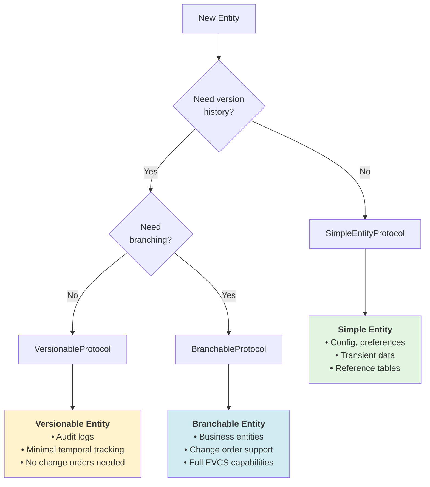

# Entity Classification Guide

**Last Updated:** 2026-01-02  
**Context:** [EVCS Core](./architecture.md)  
**Related:** [ADR-006: Protocol-Based Type System](../../decisions/ADR-006-protocol-based-type-system.md)

---

## Purpose

This guide helps you choose the appropriate entity type for your data model based on business requirements. EVCS Core provides three entity tiers, each optimized for different use cases.

---

## Quick Decision Tree



---

## Entity Type Comparison

| Aspect          | Simple                     | Versionable                      | Branchable                       |
| --------------- | -------------------------- | -------------------------------- | -------------------------------- |
| **Protocol**    | `SimpleEntityProtocol`     | `VersionableProtocol`            | `BranchableProtocol`             |
| **Timestamps**  | `created_at`, `updated_at` | `valid_time`, `transaction_time` | `valid_time`, `transaction_time` |
| **History**     | ❌ None                    | ✅ Full temporal history         | ✅ Full temporal history         |
| **Branching**   | ❌ Not supported           | ❌ Not supported                 | ✅ Supported                     |
| **Soft Delete** | ❌ Hard delete only        | ✅ `deleted_at` timestamp        | ✅ `deleted_at` timestamp        |
| **Service**     | `SimpleService[TSimple]`   | `TemporalService[TVersionable]`  | `BranchableService[TBranchable]` |
| **Storage**     | Minimal (row per entity)   | High (row per version)           | High (row per version)           |
| **Query Speed** | Fastest                    | Fast (with indexes)              | Fast (with indexes)              |

---

## Tier 1: Simple Entities

### When to Use

✅ **Use SimpleEntityProtocol when:**

- Configuration or application settings
- User preferences or UI state
- Reference/lookup tables that rarely change
- Transient data with no audit requirements
- Performance-critical read-heavy tables

❌ **Do NOT use for:**

- Business entities requiring audit trails
- Data subject to change orders
- Entities requiring temporal queries

### Implementation

```python
from app.models.domain.base import SimpleEntityBase

class UserPreference(SimpleEntityBase):
    """User UI preferences - no version history needed."""
    __tablename__ = "user_preferences"

    user_id: Mapped[UUID] = mapped_column(FG_UUID, ForeignKey("users.id"))
    theme: Mapped[str] = mapped_column(String(20), default="light")
    language: Mapped[str] = mapped_column(String(5), default="en")
    # created_at, updated_at inherited from SimpleEntityBase
```

### Operations

- **Create**: Insert new row
- **Update**: Modify row in place (sets `updated_at`)
- **Delete**: Hard delete (removes row permanently)
- **Query**: Standard `SELECT` by ID or filters

### Example Use Cases

- User preferences (theme, language, notifications)
- System configuration (feature flags, API keys)
- Lookup tables (countries, currencies, status codes)
- Session data
- Cache entries

---

## Tier 2: Versionable Entities

### When to Use

✅ **Use VersionableProtocol when:**

- Audit trail required for compliance
- Need to query "what was the value on date X?"
- Logical (soft) delete with recovery
- No branching/change order support needed
- Moderate write frequency

❌ **Do NOT use for:**

- High-frequency writes (consider event sourcing)
- Simple config without audit requirements (use Simple)
- Entities requiring change order workflow (use Branchable)

### Implementation

```python
from app.models.domain.base import EntityBase
from app.models.mixins import VersionableMixin

class AuditLog(EntityBase, VersionableMixin):
    """System audit log - temporal tracking, no branching."""
    __tablename__ = "audit_logs"

    log_id: Mapped[UUID] = mapped_column(PG_UUID, index=True)
    action: Mapped[str] = mapped_column(String(50))
    user_id: Mapped[UUID] = mapped_column(PG_UUID)
    # valid_time, transaction_time, deleted_at from VersionableMixin
```

### Operations

- **Create**: Insert with open-ended `valid_time`
- **Update**: Close current version, create new (immutable history)
- **Delete**: Set `deleted_at` (soft delete, recoverable)
- **Query**: Temporal queries (`WHERE valid_time @> NOW()`)

### Example Use Cases

- Audit logs
- User activity history
- Configuration change tracking
- Non-branching business entities (rare)

---

## Tier 3: Branchable Entities

### When to Use

✅ **Use BranchableProtocol when:**

- Core business entities
- Change order workflow support required
- Need to isolate proposed changes from live data
- Parallel development of entity states
- Merge/revert capabilities needed

❌ **Do NOT use for:**

- Simple config or preferences (use Simple)
- Entities without branching requirements (use Versionable)
- High-frequency transactional data

### Implementation

```python
from app.models.domain.base import EntityBase
from app.models.mixins import VersionableMixin, BranchableMixin

class ProjectVersion(EntityBase, VersionableMixin, BranchableMixin):
    """Project entity - full EVCS with branching."""
    __tablename__ = "project_versions"

    project_id: Mapped[UUID] = mapped_column(PG_UUID, index=True)
    name: Mapped[str] = mapped_column(String(200))
    budget: Mapped[Decimal] = mapped_column(Numeric(15, 2))
    # All temporal + branching fields from mixins
```

### Operations

- **Create**: Insert with `branch="main"`
- **Update**: Close current on branch, create new version
- **Delete**: Soft delete on specific branch
- **Branch**: Clone current version to new branch
- **Merge**: Merge source branch into target
- **Revert**: Restore previous version state

### Example Use Cases

- Projects
- Work Breakdown Elements (WBE)
- Cost Elements
- Resources
- Any entity subject to change orders

---

## Migration Guidance

### Upgrading from Simple → Versionable

```python
# Before
class Config(SimpleEntityBase):
    created_at: Mapped[datetime]  # Remove
    updated_at: Mapped[datetime]  # Remove

# After
class Config(EntityBase, VersionableMixin):
    # valid_time, transaction_time, deleted_at added automatically
```

**Data Migration:**

1. `created_at` → `lower(transaction_time)`
2. Add `valid_time` as `[created_at, NULL)`
3. Set `deleted_at = NULL`

### Upgrading from Versionable → Branchable

```python
# Before
class Entity(EntityBase, VersionableMixin):
    pass

# After
class Entity(EntityBase, VersionableMixin, BranchableMixin):
    # branch, parent_id, merge_from_branch added automatically
```

**Data Migration:**

1. Set `branch = 'main'` for all existing records
2. Set `parent_id` based on temporal ordering
3. Set `merge_from_branch = NULL`

---

## Common Anti-Patterns

### ❌ Using created_at on Versionable Entities

```python
# DON'T DO THIS
class BadEntity(EntityBase, VersionableMixin):
    created_at: Mapped[datetime]  # ❌ Redundant with transaction_time
```

**Why:** `transaction_time` already tracks when the version was created. Use `lower(transaction_time)` for creation timestamp.

### ❌ Branching Simple Entities

```python
# DON'T DO THIS
class UserPreference(SimpleEntityBase):
    branch: Mapped[str]  # ❌ Simple entities don't support branching
```

**Why:** If you need branching, use `BranchableProtocol`. Simple entities are for lightweight, non-versioned data.

### ❌ Hard Delete on Versionable/Branchable

```python
# DON'T DO THIS
session.delete(project_version)  # ❌ Loses audit trail
```

**Why:** Use soft delete (`entity.soft_delete()`) to preserve history.

---

## Decision Checklist

Use this checklist when designing a new entity:

- [ ] **Audit Required?** → If No, consider Simple
- [ ] **Version History Needed?** → If No, use Simple
- [ ] **Change Orders Apply?** → If Yes, use Branchable
- [ ] **Temporal Queries Needed?** → If Yes, use Versionable or Branchable
- [ ] **Parallel Edits?** → If Yes, use Branchable
- [ ] **High Write Frequency?** → If Yes, consider Simple or event sourcing
- [ ] **Soft Delete Required?** → If Yes, use Versionable or Branchable

---

## Examples by Domain

### Projects & Planning

- **Projects**: Branchable (change orders)
- **WBE**: Branchable (change orders)
- **Milestones**: Branchable (part of project hierarchy)
- **Project Templates**: Simple (reference data)

### Finance

- **Cost Elements**: Branchable (change orders)
- **Budget Allocations**: Branchable (change orders)
- **Payment Records**: Versionable (audit only, no branches)
- **Exchange Rates**: Simple (lookup table)

### User Management

- **Users**: Versionable (audit changes, no branches)
- **Departments**: Versionable (audit changes, no branches)
- **User Preferences**: Simple (no history needed)
- **Access Logs**: Versionable (audit only)

---

## See Also

- [EVCS Core Architecture](./architecture.md)
- [ADR-006: Protocol-Based Type System](../../decisions/ADR-006-protocol-based-type-system.md)
- [ADR-005: Bitemporal Versioning](../../decisions/ADR-005-bitemporal-versioning.md)
- [Temporal Patterns Reference](./patterns.md)
