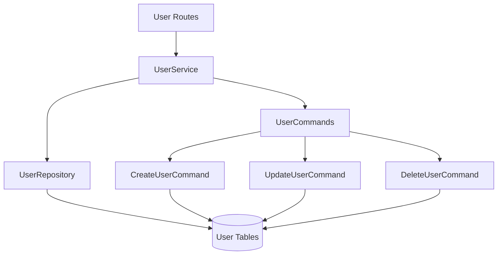

# User Management Context

**Last Updated:** 2025-12-29  
**Owner:** Backend Team

## Responsibility

Manages user profiles, roles, and permissions. Implements versioned user data with complete history tracking. Provides CRUD operations with admin authorization.

---

## Architecture

### Components

### Layers

**Routes** (`app/api/routes/users.py`)

- `GET /api/v1/users` - List users (admin only)
- `POST /api/v1/users` - Create user (admin only)
- `GET /api/v1/users/{id}` - Get user (self or admin)
- `PUT /api/v1/users/{id}` - Update user (self or admin)
- `DELETE /api/v1/users/{id}` - Soft delete (admin only)

**Service** (`app/services/user.py`)

- `get_all_users(skip, limit)` - Paginated user list
- `get_user(user_id)` - Single user retrieval
- `create_user(data, actor_id)` - New user via command
- `update_user(user_id, changes, actor_id)` - Update via command
- `delete_user(user_id, actor_id)` - Soft delete via command

**Repository** (`app/repositories/user.py`)

- `get_by_id(user_id)` - Retrieve by ID
- `get_by_email(email)` - Retrieve by email
- `get_all(skip, limit)` - Paginated retrieval
- Lower-level data access

**Commands** (`app/commands/user.py`)

- `CreateUserCommand` - Creates User + initial UserVersion
- `UpdateUserCommand` - Creates new UserVersion, closes old
- `DeleteUserCommand` - Soft delete (is_active=False)

---

## Data Model

## Data Model

### User (Single Table)

**Purpose:** Single-table bitemporal entity. Stores both identity and versioned profile data using `VersionableMixin`.

| Field            | Type      | Description                      |
| ---------------- | --------- | -------------------------------- |
| id               | UUID      | Primary Key (Version ID)         |
| user_id          | UUID      | Root Entity ID (Stable Identity) |
| email            | String    | Login email                      |
| full_name        | String    | Display name                     |
| role             | String    | admin/viewer/editor              |
| valid_time       | TSTZRANGE | Business validity range          |
| transaction_time | TSTZRANGE | System transaction time range    |
| is_active        | Boolean   | Soft delete flag                 |

**Note:** Unlike the dual-table pattern, proper bitemporal versioning is achieved via PostgreSQL `TSTZRANGE` columns on a single table, where `user_id` groups all versions of the same user.

---

## Versioning Pattern

**Type:** Bitemporal Single-Table (via EVCS Core)

### Create

1. Insert new row with new `id`, specific `user_id`.
2. `valid_time` defaults to `[now, infinity)`.
3. `transaction_time` defaults to `[now, infinity)`.

### Update

1. "Close" current version (update `valid_time` upper bound).
2. Insert new row (clone) with same `user_id`, new `id`, new data.
3. `valid_time` starts from update timestamp.

### Delete (Soft)

1. Close current version.
2. Insert new row with `is_active=False` (or `deleted_at` set).

---

## Authorization Rules

### List Users (`GET /users`)

- **Admin:** Can see all users
- **Non-admin:** 403 Forbidden

### Create User (`POST /users`)

- **Admin:** Can create any user
- **Non-admin:** 403 Forbidden

### Read User (`GET /users/{id}`)

- **Admin:** Can read any user
- **Self:** Can read own profile
- **Other:** 403 Forbidden

### Update User (`PUT /users/{id}`)

- **Admin:** Can update any user
- **Self:** Can update own profile
- **Other:** 403 Forbidden

### Delete User (`DELETE /users/{id}`)

- **Admin:** Can delete any user
- **Non-admin:** 403 Forbidden

---

## Integration Points

### Auth Context

- Used by auth context for user retrieval
- Provides `User` entity for authentication

### Future Contexts

- Will provide actor_id for audit trails
- Role used for authorization in Projects, WBEs, etc.

---

## Code Locations

- **Routes:** [`app/api/routes/users.py`](file:///home/nicola/dev/backcast_evs/backend/app/api/routes/users.py)
- **Service:** [`app/services/user.py`](file:///home/nicola/dev/backcast_evs/backend/app/services/user.py)
- **Repository:** [`app/repositories/user.py`](file:///home/nicola/dev/backcast_evs/backend/app/repositories/user.py)
- **Commands:** [`app/commands/user.py`](file:///home/nicola/dev/backcast_evs/backend/app/commands/user.py)
- **Models:** [`app/models/domain/user.py`](file:///home/nicola/dev/backcast_evs/backend/app/models/domain/user.py)
- **Schemas:** [`app/models/schemas/user.py`](file:///home/nicola/dev/backcast_evs/backend/app/models/schemas/user.py)
- **Tests:** [`tests/api/test_users.py`](file:///home/nicola/dev/backcast_evs/backend/tests/api/test_users.py), [`tests/unit/services/test_user.py`](file:///home/nicola/dev/backcast_evs/backend/tests/unit/services/test_user.py)

---

## Future Enhancements

- User profile photos
- Email verification flow
- Password reset capability
- User preferences/settings
- Activity log per user
- Department hierarchy
