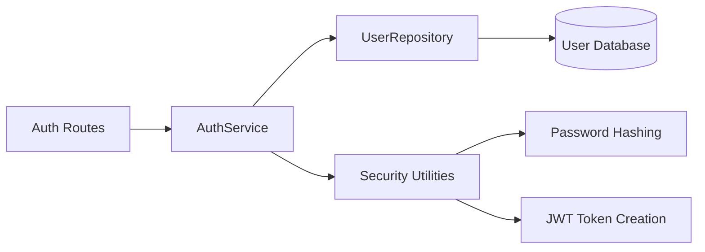

# Authentication Context

**Last Updated:** 2025-12-29  
**Owner:** Backend Team

## Responsibility

Handles user identity verification, token management, and session control. Provides authentication middleware for all protected endpoints.

---

## Architecture

### Components

### Layers

**Routes** (`app/api/routes/auth.py`)
- `/api/v1/auth/register` - New user registration
- `/api/v1/auth/login` - User authentication
- `/api/v1/auth/me` - Current user profile

**Service** (`app/services/auth.py`)
- `register(user_data)` - Create new user with password hashing
- `authenticate(email, password)` - Verify credentials, return token
- `get_user_from_token(token)` - Decode JWT, retrieve user

**Security** (`app/core/security.py`)
- `get_password_hash(password)` - Argon2 hashing
- `verify_password(plain, hashed)` - Password verification
- `create_access_token(subject)` - JWT generation
- `decode_access_token(token)` - JWT validation

---

## Data Flow

### Registration Flow
1. User submits email, password, full_name
2. `AuthService.register()` validates email uniqueness
3. Password hashed with Argon2
4. `CreateUserCommand` executes, creating User + UserVersion
5. Access token returned to client

### Login Flow
1. User submits email, password
2. `AuthService.authenticate()` retrieves user by email
3. Password verified against stored hash
4. If valid, JWT token created with user_id as subject
5. Token returned to client

### Protected Endpoint Flow
1. Client sends request with `Authorization: Bearer <token>`
2. `get_current_user` dependency extracts token
3. Token decoded and validated (signature + expiration)
4. User retrieved from database
5. `get_current_active_user` checks `is_active` flag
6. User object injected into route handler

---

## Security Model

### Password Security
- **Algorithm:** Argon2 (memory-hard, GPU-resistant)
- **Storage:** Only hashed passwords in `User.hashed_password`
- **Requirements:** Minimum 8 characters
- **Versioning:** Password changes trigger new UserVersion

### Token Security
- **Algorithm:** HS256 (HMAC-SHA256)
- **Payload:** `{"sub": "user_id", "exp": timestamp}`
- **Lifetime:** 30 minutes
- **Secret:** 256-bit key from `settings.SECRET_KEY`
- **Stateless:** Server doesn't store tokens

### Authorization
- Route-level via `Depends(get_current_active_user)`
- Role checks in service layer
- See [Security Practices](../../cross-cutting/security-practices.md)

---

## Integration Points

### Dependencies Provided
- `get_current_user()` - Returns authenticated User
- `get_current_active_user()` - Returns active User (is_active=True)

### Used By
- All protected API routes
- User management endpoints
- Future: Project, WBE, Cost Element access control

---

## Code Locations

- **Routes:** [`app/api/routes/auth.py`](file:///home/nicola/dev/backcast_evs/backend/app/api/routes/auth.py)
- **Service:** [`app/services/auth.py`](file:///home/nicola/dev/backcast_evs/backend/app/services/auth.py)
- **Security:** [`app/core/security.py`](file:///home/nicola/dev/backcast_evs/backend/app/core/security.py)
- **Dependencies:** [`app/api/dependencies/auth.py`](file:///home/nicola/dev/backcast_evs/backend/app/api/dependencies/auth.py)
- **Tests:** [`tests/api/test_auth.py`](file:///home/nicola/dev/backcast_evs/backend/tests/api/test_auth.py)

---

## Future Enhancements

- Refresh token implementation
- Two-factor authentication (2FA)
- OAuth2 integration (Google, GitHub)
- Password reset flow
- Rate limiting for auth endpoints
- Account lockout after failed attempts
