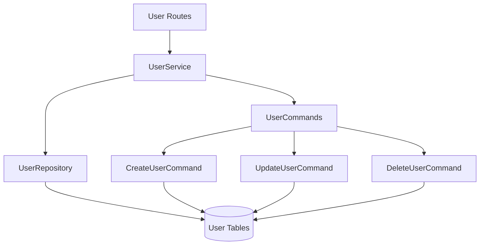

# User Management Context

**Last Updated:** 2025-12-29  
**Status:** ✅ Implemented  
**Owner:** Backend Team

## Responsibility

Manages user profiles, roles, and permissions. Implements versioned user data with complete history tracking. Provides CRUD operations with admin authorization.

---

## Architecture

### Components

### Layers

**Routes** (`app/api/routes/users.py`)
- `GET /api/v1/users` - List users (admin only)
- `POST /api/v1/users` - Create user (admin only)
- `GET /api/v1/users/{id}` - Get user (self or admin)
- `PUT /api/v1/users/{id}` - Update user (self or admin)
- `DELETE /api/v1/users/{id}` - Soft delete (admin only)

**Service** (`app/services/user.py`)
- `get_all_users(skip, limit)` - Paginated user list
- `get_user(user_id)` - Single user retrieval
- `create_user(data, actor_id)` - New user via command
- `update_user(user_id, changes, actor_id)` - Update via command
- `delete_user(user_id, actor_id)` - Soft delete via command

**Repository** (`app/repositories/user.py`)
- `get_by_id(user_id)` - Retrieve by ID
- `get_by_email(email)` - Retrieve by email
- `get_all(skip, limit)` - Paginated retrieval
- Lower-level data access

**Commands** (`app/commands/user.py`)
- `CreateUserCommand` - Creates User + initial UserVersion
- `UpdateUserCommand` - Creates new UserVersion, closes old
- `DeleteUserCommand` - Soft delete (is_active=False)

---

## Data Model

### User (Head Table)
**Purpose:** Stable identity and authentication credentials

| Field | Type | Description |
|-------|------|-------------|
| id | UUID | Primary key |
| email | String | Unique, for login |
| hashed_password | String | Argon2 hash |

**Note:** Profile data (full_name, role, department) stored in UserVersion.

### UserVersion (Version Table)
**Purpose:** Immutable profile snapshots

| Field | Type | Description |
|-------|------|-------------|
| head_id | UUID | FK to User |
| valid_from | TIMESTAMPTZ | Version start time |
| valid_to | TIMESTAMPTZ | Version end time (NULL if current) |
| full_name | String | Display name |
| role | String | admin/viewer/editor |
| department | String | Optional dept assignment |
| is_active | Boolean | Soft delete flag |
| created_by_id | UUID | Audit trail |

**Composite PK:** `(head_id, valid_from)`

---

## Versioning Pattern

**Type:** Non-branching (simple version history)

### Create
1. New User record with `id`, `email`, `hashed_password`
2. Initial UserVersion with `version=1`, `valid_from=now()`, `valid_to=NULL`
3. Relationship: `User.versions` → `[UserVersion]`

### Update
1. Close current version: `UPDATE SET valid_to=now()`
2. Create new version with updated data
3. Increment version number
4. Preserve history immutably

### Delete (Soft)
1. Same as Update, but set `is_active=False`
2. User can still authenticate but appears deleted in lists

---

## Authorization Rules

### List Users (`GET /users`)
- **Admin:** Can see all users
- **Non-admin:** 403 Forbidden

### Create User (`POST /users`)
- **Admin:** Can create any user
- **Non-admin:** 403 Forbidden

### Read User (`GET /users/{id}`)
- **Admin:** Can read any user
- **Self:** Can read own profile
- **Other:** 403 Forbidden

### Update User (`PUT /users/{id}`)
- **Admin:** Can update any user
- **Self:** Can update own profile
- **Other:** 403 Forbidden

### Delete User (`DELETE /users/{id}`)
- **Admin:** Can delete any user
- **Non-admin:** 403 Forbidden

---

## Integration Points

### Auth Context
- Used by auth context for user retrieval
- Provides `User` entity for authentication

### Future Contexts
- Will provide actor_id for audit trails
- Role used for authorization in Projects, WBEs, etc.

---

## Code Locations

- **Routes:** [`app/api/routes/users.py`](file:///home/nicola/dev/backcast_evs/backend/app/api/routes/users.py)
- **Service:** [`app/services/user.py`](file:///home/nicola/dev/backcast_evs/backend/app/services/user.py)
- **Repository:** [`app/repositories/user.py`](file:///home/nicola/dev/backcast_evs/backend/app/repositories/user.py)
- **Commands:** [`app/commands/user.py`](file:///home/nicola/dev/backcast_evs/backend/app/commands/user.py)
- **Models:** [`app/models/domain/user.py`](file:///home/nicola/dev/backcast_evs/backend/app/models/domain/user.py)
- **Schemas:** [`app/models/schemas/user.py`](file:///home/nicola/dev/backcast_evs/backend/app/models/schemas/user.py)
- **Tests:** [`tests/api/test_users.py`](file:///home/nicola/dev/backcast_evs/backend/tests/api/test_users.py), [`tests/unit/services/test_user.py`](file:///home/nicola/dev/backcast_evs/backend/tests/unit/services/test_user.py)

---

## Test Coverage

**API Tests:** 10 tests covering all CRUD operations, authorization rules  
**Service Tests:** 1 test for basic CRUD flow  
**Command Tests:** 3 tests for Create/Update/Delete commands  
**Coverage:** 81.57% overall, UserService at 74%

---

## Future Enhancements

- [ ] User profile photos
- [ ] Email verification flow
- [ ] Password reset capability
- [ ] User preferences/settings
- [ ] Activity log per user
- [ ] Department hierarchy
