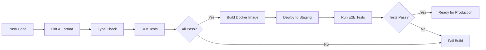

# Agile Implementation Plan: Backcast EVS Backend

## 1. Executive Summary

This document outlines a comprehensive agile implementation plan for the **Backcast EVS (Entity Versioning System)** backend—a Project Budget Management and Earned Value Management (EVM) application with Git-style versioning capabilities.

**Project Timeline:** 16 weeks (4 sprints of 4 weeks each)  
**Team Size:** 3-5 developers  
**Methodology:** Scrum with 2-week iterations  
**Delivery Approach:** Incremental with continuous integration

---

## 2. Project Vision & Goals

### 2.1 Vision Statement
Build a robust, type-safe backend system that enables project managers to track budgets, manage change orders through isolated branches, and analyze project performance using standard EVM metrics with complete historical audit trails.

### 2.2 Success Criteria
- ✅ Full CRUD operations for all core entities (Projects, WBEs, Cost Elements)
- ✅ Complete versioning system with branching and time-travel capabilities
- ✅ EVM calculations compliant with ANSI/EIA-748 standards
- ✅ 90%+ test coverage with MyPy strict mode passing
- ✅ API response times < 200ms for standard queries
- ✅ Complete API documentation via OpenAPI/Swagger

---

## 3. Agile Framework

### 3.1 Sprint Structure
- **Sprint Duration:** 2 weeks
- **Total Sprints:** 8 sprints across 4 major phases
- **Sprint Ceremonies:**
  - Sprint Planning (4 hours at sprint start)
  - Daily Standups (15 minutes)
  - Sprint Review/Demo (2 hours at sprint end)
  - Sprint Retrospective (1.5 hours at sprint end)
  - Backlog Refinement (2 hours mid-sprint)

### 3.2 Definition of Ready (DoR)
A user story is ready for sprint planning when:
- [ ] Acceptance criteria are clearly defined
- [ ] Dependencies are identified and resolved
- [ ] Story is estimated (story points)
- [ ] Technical approach is understood
- [ ] Test scenarios are outlined

### 3.3 Definition of Done (DoD)
A user story is done when:
- [ ] Code is written and peer-reviewed
- [ ] Unit tests written (>80% coverage)
- [ ] Integration tests passing
- [ ] MyPy strict mode passing
- [ ] API documentation updated
- [ ] Code merged to main branch
- [ ] Deployed to staging environment
- [ ] Product owner acceptance obtained

---

## 4. Epic Breakdown

### Epic 1: Foundation & Infrastructure
**Business Value:** Establish robust technical foundation for all future development  
**Priority:** CRITICAL  
**Estimated Duration:** Sprints 1-2

**User Stories:**
1. As a developer, I need a configured development environment so I can start coding immediately
2. As a developer, I need database migrations working so I can evolve the schema safely
3. As a system, I need async database sessions so I can handle concurrent requests efficiently
4. As a developer, I need authentication/authorization so I can secure API endpoints
5. As a developer, I need CI/CD pipeline so code quality is automatically verified

---

### Epic 2: Core Entity Management (Non-Versioned)
**Business Value:** Enable basic CRUD operations for foundational entities  
**Priority:** HIGH  
**Estimated Duration:** Sprints 2-3

**User Stories:**
1. As a user, I can create/read/update/delete users so I can manage system access
2. As a user, I can create/read/update/delete departments so I can organize work
3. As a user, I can manage user roles and permissions so I can control access levels
4. As a developer, I have Pydantic schemas for all entities so data validation is automatic
5. As a developer, I have comprehensive tests for all CRUD operations

---

### Epic 3: Entity Versioning System (EVCS Core)
**Business Value:** Implement Git-like versioning for complete audit trails  
**Priority:** CRITICAL  
**Estimated Duration:** Sprints 3-5

**User Stories:**
1. As a system, I need composite primary key support (id, branch) so entities can exist in multiple branches
2. As a system, I need version tables with immutable snapshots so history is preserved
3. As a developer, I need versioning helper functions (create/update/delete) so versioning is consistent
4. As a user, I can view entity history so I can see all changes over time
5. As a user, I can query entity state at any past date (time-travel) so I can analyze historical data
6. As a developer, I have generic VersionedRepository so versioning logic is reusable
7. As a system, I automatically filter to active/latest versions so queries return correct data

---

### Epic 4: Project Structure Management
**Business Value:** Enable hierarchical project organization  
**Priority:** HIGH  
**Estimated Duration:** Sprints 4-6

**User Stories:**
1. As a PM, I can create projects with metadata so I can organize work
2. As a PM, I can create WBEs within projects so I can track individual machines
3. As a PM, I can create cost elements within WBEs so I can track departmental budgets
4. As a PM, I can allocate revenue across WBEs so I can track profitability
5. As a PM, I can allocate budgets to cost elements so I can control spending
6. As a system, I maintain project-WBE-cost element hierarchy integrity
7. As a PM, I can view project structure in a tree view so I can understand organization

---

### Epic 5: Financial Data Management
**Business Value:** Track costs, forecasts, and earned value  
**Priority:** HIGH  
**Estimated Duration:** Sprints 5-7

**User Stories:**
1. As a PM, I can register actual costs against cost elements so I can track spending
2. As a PM, I can create/update forecasts (EAC) so I can predict final costs
3. As a PM, I can record earned value (% complete) so I can measure progress
4. As a PM, I can define schedule baselines with progression types so I can calculate planned value
5. As a system, I validate cost registrations against budgets
6. As a PM, I can view cost history and trends so I can analyze spending patterns
7. As a PM, I can manage quality events so I can track rework costs

---

### Epic 6: Branching & Change Order Management
**Business Value:** Enable isolated change order development  
**Priority:** CRITICAL  
**Estimated Duration:** Sprints 6-8

**User Stories:**
1. As a PM, I can create change orders so I can propose scope changes
2. As a system, I automatically create branches for change orders so changes are isolated
3. As a PM, I can modify entities in a branch so I can model change impacts
4. As a PM, I can compare branch to main so I can see what changed
5. As a PM, I can merge approved change orders so changes become official
6. As a PM, I can lock/unlock branches so I can prevent unwanted modifications
7. As a system, I provide merged view showing main + branch changes
8. As a PM, I can delete/archive branches so I can clean up rejected changes

---

### Epic 7: Baseline Management
**Business Value:** Capture project snapshots at key milestones  
**Priority:** MEDIUM  
**Estimated Duration:** Sprints 7-8

**User Stories:**
1. As a PM, I can create baselines at milestones so I can track progress
2. As a system, I snapshot all cost element data when baseline is created
3. As a PM, I can compare current state to any baseline so I can analyze variance
4. As a PM, I can mark baselines as PMB so I can identify performance measurement baseline
5. As a PM, I can cancel baselines so I can correct mistakes
6. As a system, I preserve baseline schedule registrations immutably

---

### Epic 8: EVM Calculations & Reporting
**Business Value:** Provide standard EVM metrics and analytics  
**Priority:** HIGH  
**Estimated Duration:** Sprints 7-8

**User Stories:**
1. As a PM, I can calculate PV using schedule baselines so I can track planned value
2. As a PM, I can calculate EV from % complete so I can measure earned value
3. As a PM, I can calculate AC from cost registrations so I can track actual costs
4. As a PM, I can view CPI/SPI/TCPI so I can assess performance
5. As a PM, I can view CV/SV/VAC so I can analyze variances
6. As a PM, I can generate cost performance reports so I can communicate status
7. As a PM, I can generate variance analysis reports so I can explain deviations
8. As a PM, I can use time machine control so I can view metrics at any past date

---

## 5. Sprint Plan

### **Phase 1: Foundation (Sprints 1-2)**

#### Sprint 1: Infrastructure Setup
**Goal:** Establish development environment and core infrastructure

**Stories (Story Points: 21)**
- [8 pts] Setup project structure, dependencies, and tooling (uv, ruff, mypy, pytest)
- [5 pts] Configure async database with SQLAlchemy 2.0 + Alembic migrations
- [5 pts] Implement authentication/authorization with JWT
- [3 pts] Setup CI/CD pipeline (GitHub Actions: lint, type-check, test)

**Deliverables:**
- ✅ Working dev environment with all tools configured
- ✅ Database connection and migration system
- ✅ Basic auth endpoints (/login, /register)
- ✅ CI pipeline running on every PR

---

#### Sprint 2: Core Infrastructure & User Management
**Goal:** Complete foundation and implement user management

**Stories (Story Points: 23)**
- [5 pts] Implement User CRUD with repository pattern
- [5 pts] Implement Department CRUD
- [5 pts] Create Pydantic schemas for request/response validation
- [5 pts] Write comprehensive tests (unit + integration)
- [3 pts] Setup API documentation (OpenAPI/Swagger)

**Deliverables:**
- ✅ User management endpoints (/users/*)
- ✅ Department management endpoints (/departments/*)
- ✅ 80%+ test coverage
- ✅ Interactive API docs at /docs

---

### **Phase 2: Versioning System (Sprints 3-4)**

#### Sprint 3: EVCS Core Implementation
**Goal:** Implement entity versioning system foundation

**Stories (Story Points: 26)**
- [8 pts] Create VersionableHeadMixin and VersionSnapshotMixin
- [8 pts] Implement generic VersionedRepository with type safety
- [5 pts] Create versioning helpers (create_entity_with_version, update_entity_with_version, soft_delete_entity)
- [5 pts] Write versioning system tests

**Deliverables:**
- ✅ Reusable versioning mixins
- ✅ Generic repository with MyPy validation
- ✅ Helper functions for all lifecycle operations
- ✅ Comprehensive versioning tests

---

#### Sprint 4: Time-Travel & History Queries
**Goal:** Enable historical queries and version navigation

**Stories (Story Points: 24)**
- [8 pts] Implement get_entity_at_date (time-travel queries)
- [5 pts] Implement version history retrieval
- [5 pts] Create hydration utilities for version data
- [3 pts] Add time machine context to API dependencies
- [3 pts] Write time-travel query tests

**Deliverables:**
- ✅ Time-travel query support
- ✅ Version history endpoints
- ✅ Time machine date context in API
- ✅ Historical query tests

---

### **Phase 3: Core Entities (Sprints 5-6)**

#### Sprint 5: Project & WBE Management
**Goal:** Implement hierarchical project structure

**Stories (Story Points: 25)**
- [8 pts] Implement Project entity with versioning (head + version tables)
- [8 pts] Implement WBE entity with versioning
- [5 pts] Implement project-WBE relationship management
- [4 pts] Create API endpoints for projects and WBEs

**Deliverables:**
- ✅ Project CRUD with versioning
- ✅ WBE CRUD with versioning
- ✅ Hierarchical relationship integrity
- ✅ API endpoints: /projects/*, /wbes/*

---

#### Sprint 6: Cost Elements & Financial Structure
**Goal:** Complete project hierarchy and enable budget allocation

**Stories (Story Points: 26)**
- [8 pts] Implement CostElement entity with versioning
- [5 pts] Implement budget allocation logic
- [5 pts] Implement revenue allocation across WBEs
- [5 pts] Create validation rules for budget integrity
- [3 pts] Write hierarchy and allocation tests

**Deliverables:**
- ✅ Cost element CRUD with versioning
- ✅ Budget allocation endpoints
- ✅ Revenue allocation logic
- ✅ Budget validation rules

---

### **Phase 4: Advanced Features (Sprints 7-8)**

#### Sprint 7: Branching & Change Orders
**Goal:** Implement branch isolation and change order workflow

**Stories (Story Points: 28)**
- [8 pts] Implement branch creation with deep copy
- [8 pts] Implement change order entity and workflow
- [5 pts] Implement branch comparison logic
- [5 pts] Implement branch merge operation
- [2 pts] Add branch locking mechanism

**Deliverables:**
- ✅ Branch creation and management
- ✅ Change order workflow
- ✅ Branch comparison endpoints
- ✅ Merge functionality

---

#### Sprint 8: EVM Calculations & Baselines
**Goal:** Enable EVM reporting and baseline management

**Stories (Story Points: 27)**
- [8 pts] Implement baseline creation and snapshotting
- [8 pts] Implement EVM calculation engine (PV, EV, AC, CPI, SPI, etc.)
- [5 pts] Implement schedule baseline with progression types
- [3 pts] Create cost/forecast registration endpoints
- [3 pts] Create variance analysis reports

**Deliverables:**
- ✅ Baseline management endpoints
- ✅ EVM calculation service
- ✅ Schedule baseline logic
- ✅ Performance reports

---

## 6. Technical Implementation Strategy

### 6.1 Development Principles

#### Type Safety First
- **Strict MyPy:** All code must pass `mypy --strict`
- **Pydantic Validation:** All API inputs/outputs validated
- **Generic Types:** Use TypeVar for reusable components
- **Protocol Classes:** Define interfaces for duck typing

#### Test-Driven Development (TDD)
- **Write tests first** for all new features
- **Test Pyramid:** 70% unit, 20% integration, 10% E2E
- **Coverage Target:** Minimum 80%, aim for 90%+
- **Test Categories:**
  - Unit tests: Repository, service, helper functions
  - Integration tests: API endpoints with database
  - E2E tests: Complete workflows

#### Clean Architecture
- **Layer Separation:** API → Service → Repository → Database
- **Dependency Injection:** Use FastAPI's DI system
- **Single Responsibility:** Each class/function has one purpose
- **DRY Principle:** Reuse through mixins, generics, helpers

### 6.2 Code Quality Standards

```python
# Example: Proper type hints and documentation
from typing import Protocol
from uuid import UUID
from sqlalchemy.ext.asyncio import AsyncSession

class VersionableEntity(Protocol):
    """Protocol defining versionable entity interface."""
    id: UUID
    branch: str
    status: str

async def create_entity_with_version(
    session: AsyncSession,
    head_model: type[HeadT],
    version_model: type[VersionT],
    data: dict[str, Any],
    branch: str = "main",
    user_id: UUID | None = None,
) -> HeadT:
    """
    Create new entity with initial version.
    
    Args:
        session: Database session
        head_model: Head table model class
        version_model: Version table model class
        data: Entity data dictionary
        branch: Branch name (default: "main")
        user_id: User creating the entity
        
    Returns:
        Created head entity with version
        
    Raises:
        ValueError: If required data is missing
        IntegrityError: If entity already exists
    """
    # Implementation...
```

### 6.3 Database Migration Strategy

**Alembic Best Practices:**
- Auto-generate migrations from model changes
- Review and edit generated migrations
- Test migrations on copy of production data
- Always provide downgrade path
- Use batch operations for large tables

```bash
# Migration workflow
alembic revision --autogenerate -m "Add versioning to projects"
alembic upgrade head  # Apply migration
alembic downgrade -1  # Rollback if needed
```

### 6.4 API Design Principles

**RESTful Conventions:**
- `GET /projects/` - List projects
- `GET /projects/{id}` - Get specific project
- `POST /projects/` - Create project
- `PUT /projects/{id}` - Update project
- `DELETE /projects/{id}` - Soft delete project
- `GET /projects/{id}/history` - Get version history
- `GET /projects/{id}/versions/{version}` - Get specific version

**Query Parameters:**
- `?branch=co-123` - Filter by branch
- `?control_date=2024-01-15` - Time-travel query
- `?include_deleted=true` - Include soft-deleted entities
- `?page=2&limit=50` - Pagination

**Response Format:**
```json
{
  "data": {...},
  "meta": {
    "version": 1,
    "branch": "main",
    "valid_from": "2024-01-15T10:30:00Z",
    "created_by": "user-uuid"
  }
}
```

---

## 7. Risk Management

### 7.1 Technical Risks

| Risk | Impact | Probability | Mitigation Strategy |
|------|--------|-------------|---------------------|
| **Versioning complexity causes performance issues** | HIGH | MEDIUM | - Implement proper indexes on (head_id, branch, valid_from)<br>- Use EXPLAIN ANALYZE for query optimization<br>- Add caching layer for frequently accessed data |
| **MyPy strict mode blocks development** | MEDIUM | MEDIUM | - Invest in type hint training<br>- Create type hint templates<br>- Use `# type: ignore` sparingly with justification |
| **Branch merge conflicts** | HIGH | LOW | - Implement pessimistic locking during merge<br>- Provide merge preview before commit<br>- Add conflict detection logic |
| **Database migration failures** | HIGH | LOW | - Test migrations on staging first<br>- Maintain rollback scripts<br>- Use database backups before migrations |
| **Async/await complexity** | MEDIUM | MEDIUM | - Provide async patterns documentation<br>- Code review focus on async correctness<br>- Use pytest-asyncio for testing |

### 7.2 Process Risks

| Risk | Impact | Probability | Mitigation Strategy |
|------|--------|-------------|---------------------|
| **Scope creep** | HIGH | HIGH | - Strict backlog prioritization<br>- Product owner approval for new features<br>- Time-box spike investigations |
| **Team velocity uncertainty** | MEDIUM | MEDIUM | - Track velocity over first 2 sprints<br>- Adjust sprint commitments based on data<br>- Maintain buffer in sprint planning |
| **Knowledge silos** | MEDIUM | MEDIUM | - Pair programming on complex features<br>- Code review requirements<br>- Documentation as DoD requirement |
| **Testing debt accumulation** | HIGH | MEDIUM | - Tests required in DoD<br>- Coverage gates in CI<br>- Dedicated test refactoring time |

---

## 8. Quality Assurance Strategy

### 8.1 Automated Testing

**Test Structure:**
```
backend/tests/
├── unit/
│   ├── repositories/
│   ├── services/
│   └── helpers/
├── integration/
│   ├── api/
│   └── database/
└── e2e/
    └── workflows/
```

**Test Coverage Requirements:**
- **Unit Tests:** 90%+ coverage for services and repositories
- **Integration Tests:** All API endpoints with happy path + error cases
- **E2E Tests:** Critical workflows (create project → add WBE → create change order → merge)

**Continuous Testing:**
```yaml
# .github/workflows/test.yml
on: [push, pull_request]
jobs:
  test:
    runs-on: ubuntu-latest
    steps:
      - uses: actions/checkout@v3
      - name: Run tests
        run: |
          uv sync
          uv run pytest --cov=app --cov-report=xml
          uv run mypy app --strict
```

### 8.2 Code Review Process

**Review Checklist:**
- [ ] Code follows project style guide
- [ ] Type hints present and correct
- [ ] Tests written and passing
- [ ] Documentation updated
- [ ] No security vulnerabilities
- [ ] Performance considerations addressed
- [ ] Error handling appropriate

**Review SLA:**
- First review within 24 hours
- Address feedback within 48 hours
- Maximum 3 review cycles before escalation

---

## 9. Documentation Requirements

### 9.1 Technical Documentation

**Required Documents:**
- [x] Backend Architecture (already exists)
- [x] PRD (already exists)
- [ ] API Reference (auto-generated from OpenAPI)
- [ ] Database Schema Diagram
- [ ] Entity Versioning Guidelines (already exists)
- [ ] Deployment Guide
- [ ] Developer Onboarding Guide

### 9.2 Code Documentation

**Docstring Requirements:**
- All public functions/methods must have docstrings
- Include Args, Returns, Raises sections
- Provide usage examples for complex functions
- Document type parameters for generics

---

## 10. Deployment Strategy

### 10.1 Environment Strategy

| Environment | Purpose | Deployment Trigger | Database |
|-------------|---------|-------------------|----------|
| **Development** | Local development | Manual | Local PostgreSQL |
| **Staging** | Integration testing | Merge to `develop` branch | Staging PostgreSQL |
| **Production** | Live system | Tag release | Production PostgreSQL |

### 10.2 CI/CD Pipeline



### 10.3 Database Migration Strategy

**Pre-Production Checklist:**
- [ ] Backup production database
- [ ] Test migration on production copy
- [ ] Verify rollback procedure
- [ ] Schedule maintenance window
- [ ] Prepare rollback plan

---

## 11. Success Metrics

### 11.1 Development Metrics

| Metric | Target | Measurement |
|--------|--------|-------------|
| **Sprint Velocity** | 25 ± 3 story points | Track completed points per sprint |
| **Code Coverage** | ≥ 85% | Automated coverage reports |
| **MyPy Compliance** | 100% strict mode | CI pipeline check |
| **Bug Escape Rate** | < 5% to production | Track bugs found in prod vs staging |
| **PR Review Time** | < 24 hours | GitHub metrics |
| **Build Success Rate** | > 95% | CI pipeline analytics |

### 11.2 Performance Metrics

| Metric | Target | Measurement |
|--------|--------|-------------|
| **API Response Time (p95)** | < 200ms | Application monitoring |
| **Database Query Time (p95)** | < 100ms | Query logging |
| **Time-Travel Query (p95)** | < 500ms | Performance tests |
| **Branch Merge Time** | < 5 seconds | Integration tests |

### 11.3 Quality Metrics

| Metric | Target | Measurement |
|--------|--------|-------------|
| **API Documentation Coverage** | 100% endpoints | OpenAPI spec completeness |
| **Type Hint Coverage** | 100% | MyPy coverage report |
| **Test Flakiness** | < 1% | Track test failures |
| **Security Vulnerabilities** | 0 critical/high | Dependency scanning |

---

## 12. Team Structure & Roles

### 12.1 Recommended Team Composition

**Core Team (5 people):**
- **Product Owner** (1): Prioritizes backlog, defines acceptance criteria
- **Scrum Master** (1): Facilitates ceremonies, removes blockers
- **Backend Developers** (3): Implement features, write tests, review code

**Extended Team:**
- **DevOps Engineer** (0.5 FTE): CI/CD, infrastructure, monitoring
- **QA Engineer** (0.5 FTE): E2E testing, test strategy

### 12.2 Responsibilities Matrix

| Role | Sprint Planning | Daily Standup | Development | Code Review | Testing | Documentation |
|------|----------------|---------------|-------------|-------------|---------|---------------|
| **Product Owner** | Lead | Attend | - | - | Acceptance | Requirements |
| **Scrum Master** | Facilitate | Facilitate | - | - | - | Process |
| **Backend Dev** | Participate | Lead | Primary | Primary | Unit/Integration | Technical |
| **DevOps** | Consult | Attend | Infrastructure | Review | Deployment | Deployment |
| **QA** | Consult | Attend | Test Automation | Review | E2E | Test Plans |

---

## 13. Communication Plan

### 13.1 Ceremonies Schedule

**Sprint Cadence (2-week sprints):**
- **Monday Week 1:** Sprint Planning (9:00-13:00)
- **Daily:** Standup (9:00-9:15)
- **Wednesday Week 1:** Backlog Refinement (14:00-16:00)
- **Friday Week 2:** Sprint Review (14:00-16:00)
- **Friday Week 2:** Sprint Retrospective (16:00-17:30)

### 13.2 Communication Channels

| Channel | Purpose | Response Time |
|---------|---------|---------------|
| **Slack #backcast-dev** | Daily communication | < 2 hours |
| **GitHub Issues** | Bug tracking, feature requests | < 1 day |
| **GitHub PRs** | Code review | < 24 hours |
| **Confluence** | Documentation | Async |
| **Zoom** | Ceremonies, pair programming | Scheduled |

---

## 14. Appendix: Story Point Reference

### 14.1 Estimation Guide

| Points | Complexity | Time Estimate | Example |
|--------|------------|---------------|---------|
| **1** | Trivial | 1-2 hours | Add validation rule |
| **2** | Simple | 2-4 hours | Add new field to existing entity |
| **3** | Easy | 4-8 hours | Simple CRUD endpoint |
| **5** | Medium | 1-2 days | Complex endpoint with business logic |
| **8** | Complex | 2-4 days | New entity with versioning |
| **13** | Very Complex | 4-6 days | Branch merge implementation |
| **21** | Epic | 1-2 weeks | Complete versioning system |

### 14.2 Velocity Tracking Template

| Sprint | Committed Points | Completed Points | Velocity | Notes |
|--------|------------------|------------------|----------|-------|
| 1 | 21 | 21 | 21 | Infrastructure setup completed |
| 2 | 23 | - | - | User management & Core Infrastructure |
| 3 | 26 | TBD | TBD | EVCS core |
| 4 | 24 | TBD | TBD | Time-travel queries |
| 5 | 25 | TBD | TBD | Projects & WBEs |
| 6 | 26 | TBD | TBD | Cost elements |
| 7 | 28 | TBD | TBD | Branching |
| 8 | 27 | TBD | TBD | EVM & baselines |

---

## 15. Next Steps

### 15.1 Immediate Actions (Week 1)

1. **Team Formation**
   - [ ] Assign roles (PO, SM, Devs)
   - [ ] Schedule kickoff meeting
   - [ ] Setup communication channels

2. **Environment Setup**
   - [ ] Provision development infrastructure
   - [ ] Setup GitHub repository
   - [ ] Configure CI/CD pipeline
   - [ ] Create project boards

3. **Sprint 1 Preparation**
   - [ ] Refine Sprint 1 stories
   - [ ] Assign story points
   - [ ] Identify dependencies
   - [ ] Schedule Sprint 1 planning

### 15.2 Success Checkpoints

**End of Sprint 2:**
- [ ] Foundation complete and stable
- [ ] Team velocity established
- [ ] CI/CD pipeline operational

**End of Sprint 4:**
- [ ] Versioning system fully functional
- [ ] Time-travel queries working
- [ ] 80%+ test coverage achieved

**End of Sprint 6:**
- [ ] Complete project hierarchy implemented
- [ ] Budget allocation working
- [ ] All core entities versioned

**End of Sprint 8:**
- [ ] Branching and merging operational
- [ ] EVM calculations accurate
- [ ] System ready for production deployment

---

## 16. Conclusion

This agile implementation plan provides a structured, incremental approach to building the Backcast EVS backend. By following the sprint plan, maintaining quality standards, and adhering to agile principles, the team will deliver a robust, type-safe, and fully tested system that meets all requirements outlined in the PRD.

**Key Success Factors:**
- ✅ Strong type safety with MyPy strict mode
- ✅ Comprehensive test coverage (>85%)
- ✅ Clean architecture with clear layer separation
- ✅ Incremental delivery with working software every sprint
- ✅ Continuous integration and automated quality checks
- ✅ Regular stakeholder feedback through sprint reviews

**Project Motto:** *"Type-safe, test-driven, incrementally delivered."*

---

**Document Version:** 1.0  
**Last Updated:** 2025-12-27  
**Owner:** Development Team  
**Status:** APPROVED FOR EXECUTION
